<div align="center">


# Arena Dude

**Stop guessing your Arena picks.**

A pixel coach sits next to Hearthstone, rates every card you're offered with real winrates and tier scores,<br>
and tells you which one to take. Then he scouts your opponents and fixes your redrafts.

<sub><i>"Take the one I point at. You can thank me after 12 wins."</i> &nbsp;— the Dude</sub>

<br>

<a href="https://github.com/arenadude/arenadude/releases/latest/download/Arena.Dude.Mac.zip"></a>

<a href="https://github.com/arenadude/arenadude/releases/latest"></a>

<a href="LICENSE"></a>
<a href="https://discord.gg/rX5ktJJzD8"></a>

<sub>Free · Apple Silicon · English client · <a href="#get-it">First-run steps</a> · <a href="https://arenadude.github.io/arenadude/">arenadude.github.io/arenadude</a></sub>

<br><br>

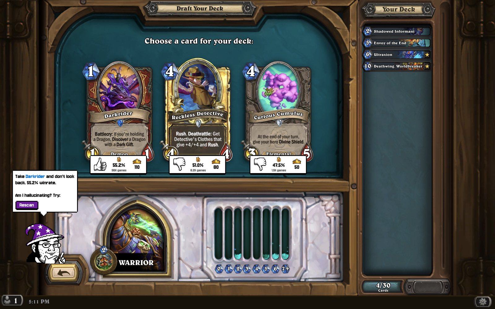

</div>

<br>

**Free for everyone** · **Real data**, refreshed twice a month · **Safe by design**: never touches game memory · **Open source**, GPL v2

## Read a plate in two seconds

Every card you're offered gets a plate right under it, on the draft screen itself. No extra window, no alt-tabbing.

<table>
<tr>
<td align="center" width="33%"><br><b>1 · The verdict</b><br><sub>Thumbs up on the card the Dude would take, down on the rest. Both sources weighed into one call.</sub></td>
<td align="center" width="33%"><br><b>2 · Firestone winrate</b><br><sub>How often Arena decks with this card win, and from how many games. More games, more trust.</sub></td>
<td align="center" width="33%"><br><b>3 · HearthArena score</b><br><sub>The card's score on the HearthArena tier list. Higher is better.</sub></td>
</tr>
</table>

### Your turn. Which one do you take?

A real pick from a Warrior draft. Open a card to see its plate and what the Dude thinks of your choice.

<table>
<tr>
<td align="center" width="33%" valign="top">
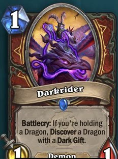
<details><summary><b>Take Darkrider</b></summary>
<br>
 &nbsp;<b>55.2%</b> <sub>96K games</sub> &nbsp;·&nbsp; <b>110</b> <sub>HA</sub>
<br><br>
<br>
<i>"Darkrider. Great minds. 55.2% winrate and the top score, I'd take it too."</i>
</details>
</td>
<td align="center" width="33%" valign="top">
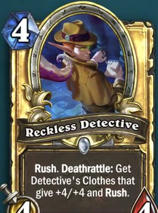
<details><summary><b>Take Reckless Detective</b></summary>
<br>
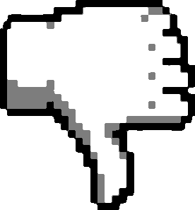 &nbsp;<b>51.0%</b> <sub>8.2K games</sub> &nbsp;·&nbsp; <b>80</b> <sub>HA</sub>
<br><br>
<br>
<i>"The golden one? Shiny, I know. But 51.0% and a thumbs down. Darkrider's the pick."</i>
</details>
</td>
<td align="center" width="33%" valign="top">
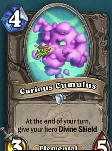
<details><summary><b>Take Curious Cumulus</b></summary>
<br>
 &nbsp;<b>47.5%</b> <sub>1.5K games</sub> &nbsp;·&nbsp; <b>50</b> <sub>HA</sub>
<br><br>
<br>
<i>"The cloud? Cute, but 47.5% from 1.5K games. Darkrider's the pick."</i>
</details>
</td>
</tr>
</table>

## Everything he does. All free.

From the hero choice to the loot chest.

<table>
<tr>
<td width="50%" valign="top">
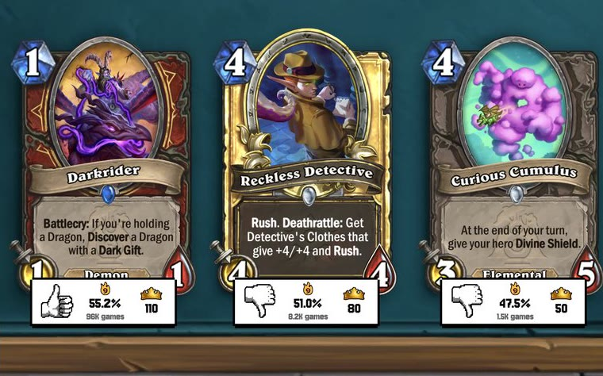

**Rates every card.** A plate under each card on the draft screen: thumbs up or down, the Firestone winrate with its games, and the HearthArena score. Golden and signature cards too.

> *"Thumbs up: take it. Thumbs down: I've seen better."*
</td>
<td width="50%" valign="top">
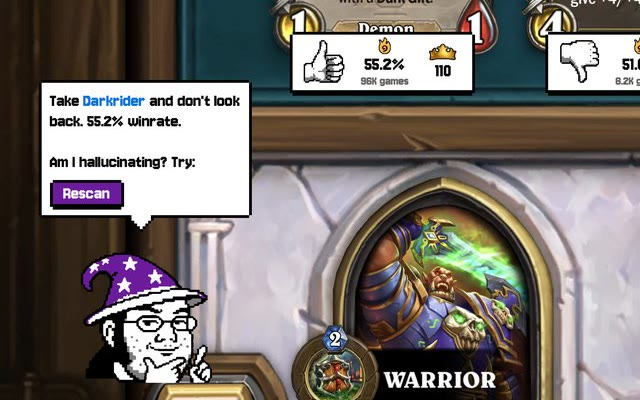

**Picks for you.** Both sources combined into one pick, said out loud by the mascot from his corner. With commentary.

> *"Take Darkrider and don't look back."*
</td>
</tr>
<tr>
<td width="50%" valign="top">
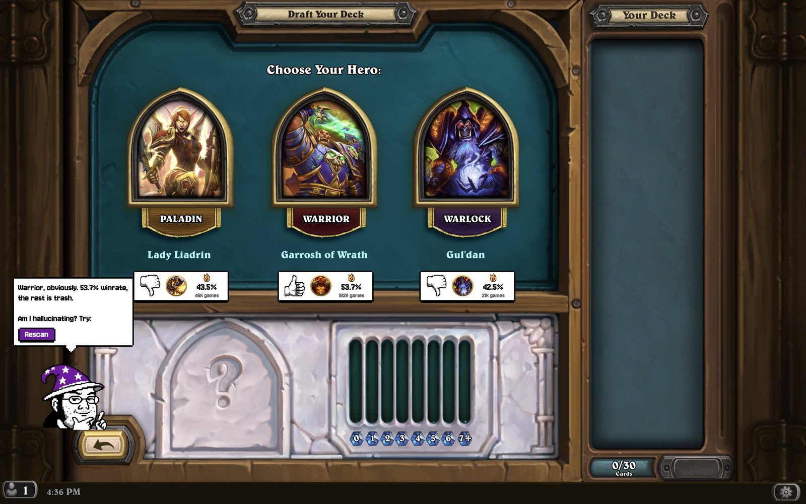

**Finds the best class.** Each hero's Arena winrate this season, before you even pick. The Dude names the winner.

> *"Warrior, obviously. 53.7% winrate."*
</td>
<td width="50%" valign="top">
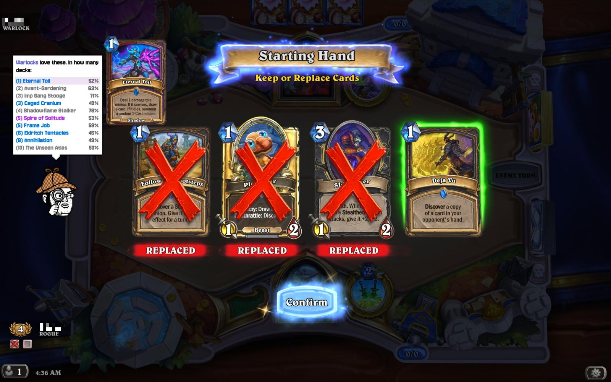

**Scouts the opponent** <sup>NEW</sup>. At the mulligan: the 10 cards your opponent's class plays best in Arena, by mana cost, so you know what to play around.

> *"Warlocks love these."*
</td>
</tr>
<tr>
<td width="50%" valign="top">
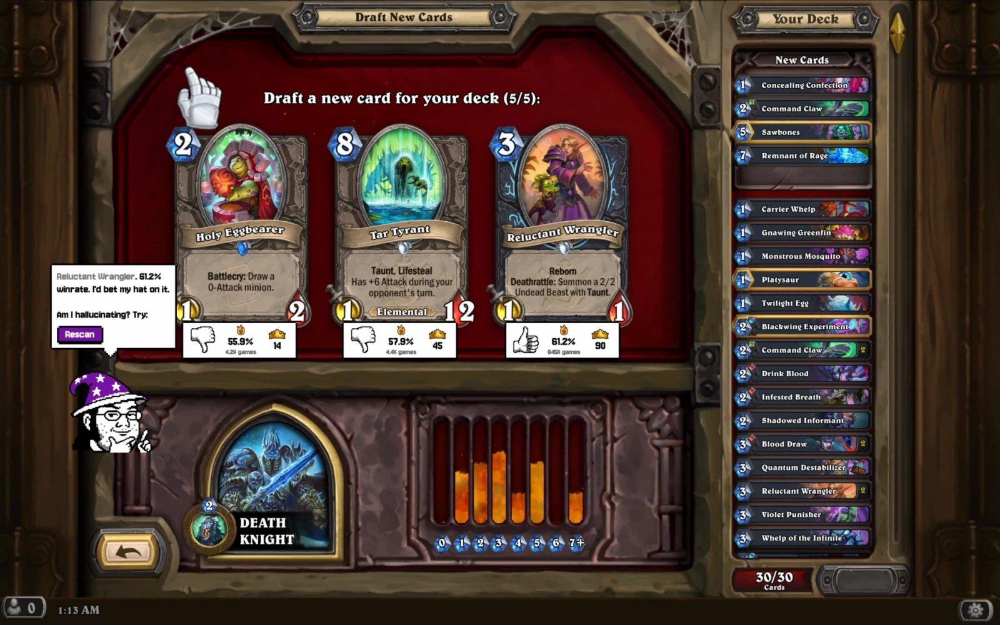

**Fixes your redraft.** After a loss you draft new cards: each one gets its plate, and the Dude picks the best.

> *"Reluctant Wrangler. 61.2% winrate. I'd bet my hat on it."*
</td>
<td width="50%" valign="top">
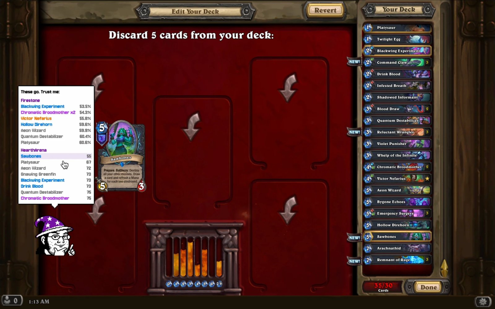

**Removal hints.** Then Hearthstone makes you discard. The Dude lists the weakest cards, worst first, by Firestone and by HearthArena. Hover one to see it.

> *"These go. Trust me."*
</td>
</tr>
</table>

### Watches your run

Your record per run, a verdict on the finished deck, and a reaction to every win and loss. Supportive when RNG isn't.

<table>
<tr><td width="72"></td><td><b>SEVEN WINS.</b> Told you this deck was a beast.</td></tr>
<tr><td width="72"></td><td>Two down. Deep breath, we've still got this.</td></tr>
<tr><td width="72"></td><td><b>TWELVE WINS!</b> I drafted it, you just clicked. We're legends.</td></tr>
</table>

## Get it

<table>
<tr>
<td width="90"></td>
<td><i>"macOS gets nervous about me the first time. A few clicks and we're friends. You only do this once."</i></td>
</tr>
</table>

**You need:**

- A Mac with **Apple Silicon** and a recent macOS (tested on macOS 15).
- Hearthstone in **English**: the Dude reads card names in English.
- The **Screen Recording** permission (System Settings → Privacy & Security → Screen & System Audio Recording). Without it the mascot can't see your draft.

**Install in 2 minutes:**

1. Download [**Arena.Dude.Mac.zip**](https://github.com/arenadude/arenadude/releases/latest/download/Arena.Dude.Mac.zip), unzip it and drag **Arena Dude** into your Applications folder.
2. Open it. macOS stops it the first time (it isn't notarized by Apple yet): click **Done**.
3. Open **System Settings → Privacy & Security**, scroll down to *"Arena Dude" was blocked to protect your Mac* and click **Open Anyway**.
4. Click **Open Anyway** again and confirm with Touch ID or your password. Steps 2–4 happen only once.
5. When macOS asks, click **Open System Settings**, turn on Arena Dude in **Screen & System Audio Recording**, then quit and reopen it.
6. Start Hearthstone, head to the Arena and click **Allow** on the privacy reminder macOS shows over the game. On the first run the Dude also downloads the card images, about a minute.

<details>
<summary><b>Show me the screenshots</b></summary>
<br>

| 2 · Click Done | 3 · Open Anyway |
|:-:|:-:|
| 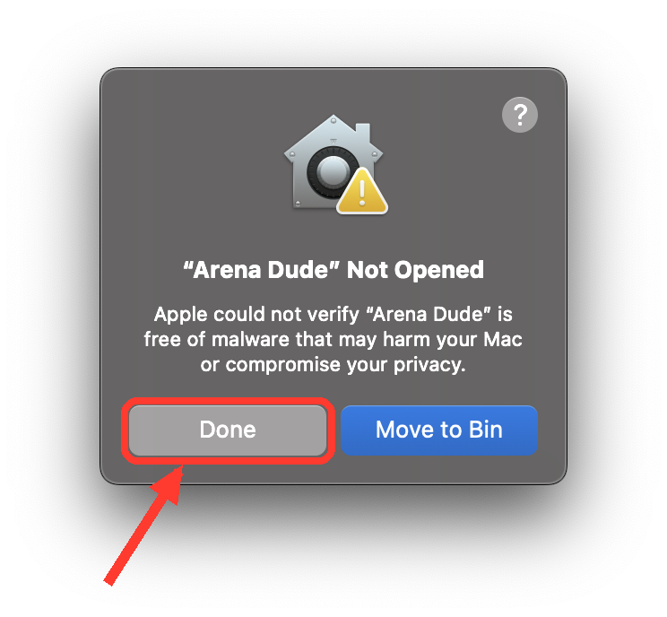 | 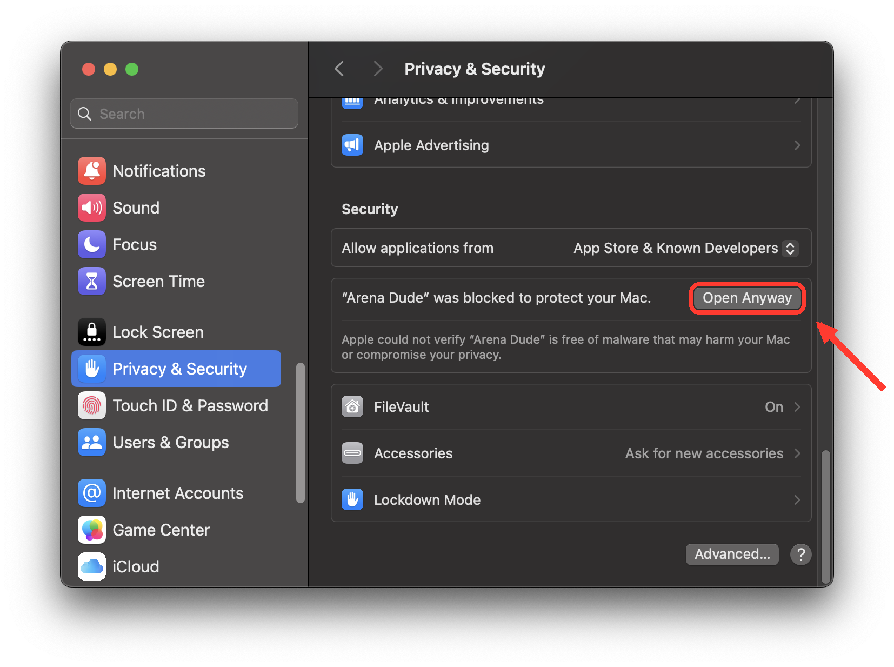 |

| 4 · Open Anyway again | 4 · Confirm |
|:-:|:-:|
| 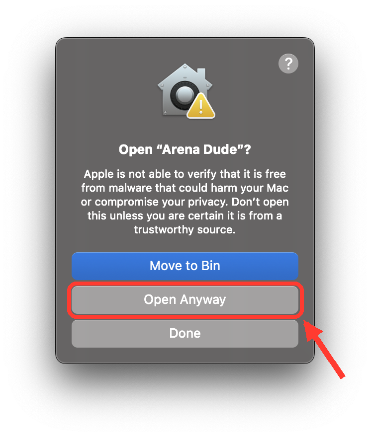 | 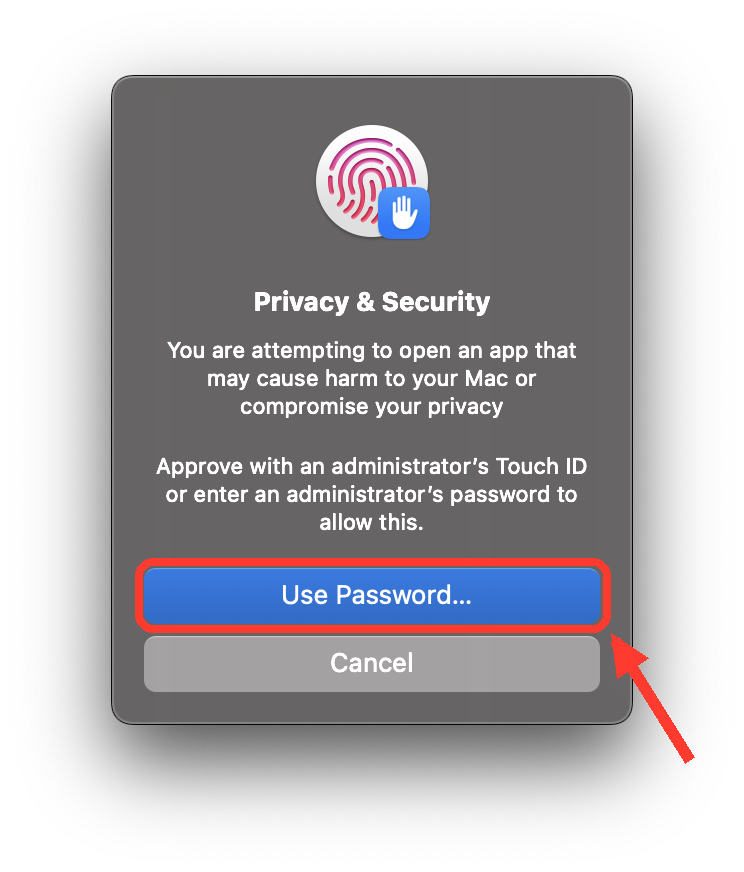 |

| 5 · Screen Recording | 6 · Allow over the game |
|:-:|:-:|
| 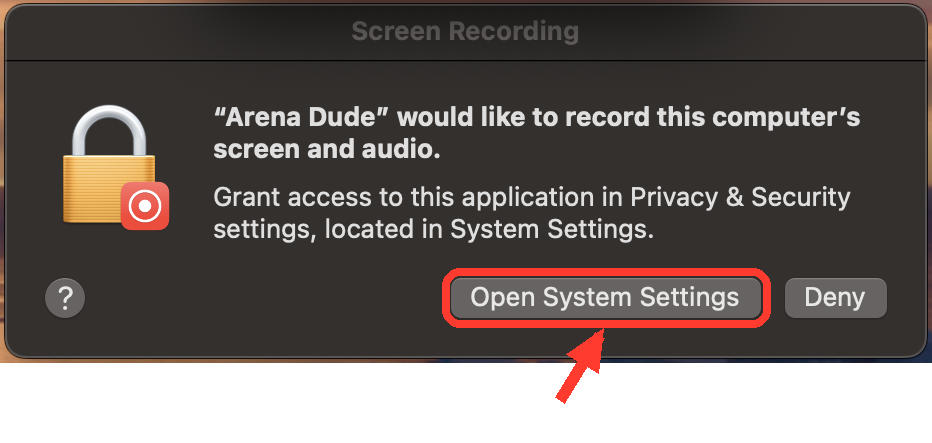 | 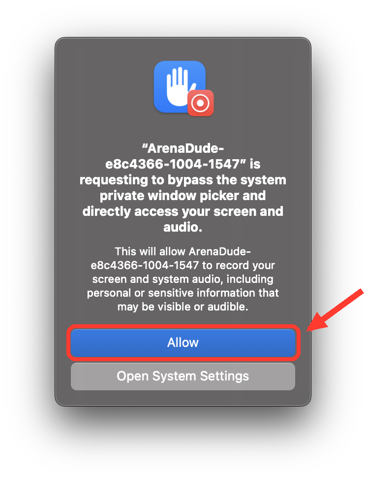 |

</details>

All versions and release notes: [Releases](https://github.com/arenadude/arenadude/releases/latest).

## Meet the animated Dude

<p align="center">


</p>

Arena Dude is free and stays free. Patrons keep it going, and get a livelier Dude as a thank-you: he jumps after your wins, munches popcorn through your games, squints through his magnifier at the mulligan and taps his chin over a tough pick.

**[Support on Patreon](https://www.patreon.com/arenadude)** ($3 / month). Your support pays for data updates every patch, new features and an Apple developer account (no more "Open Anyway"). Already a patron? Your code is in the patrons-only post: right-click the Dude, choose **Unlock animated mascot…** and paste it.

## Hang out

**[Join the Discord](https://discord.gg/rX5ktJJzD8)**: talk Arena, post your drafts in #arena-runs (12 wins or a heroic 0-3), suggest features in #suggestions.

**Found a bug?** Right-click the Dude and choose **Report a problem**: it opens [#bug-reports](https://discord.gg/vZ8aHHG5mE) and shows your log file, ready to attach. Or [open an issue](https://github.com/arenadude/arenadude/issues).

## FAQ

<table>
<tr>
<td width="90"></td>
<td><i>"Elementary questions, the Dude has answers."</i></td>
</tr>
</table>

<details>
<summary><b>Is it free?</b></summary>
<br>
Yes. Arena Dude is free and open source, and every feature that helps you win is for everyone. Patrons get the animated Dude as a thank-you.
</details>

<details>
<summary><b>How does it know what's on screen? Is it safe?</b></summary>
<br>
It reads Hearthstone's log files and looks at the screen to read the cards you're offered, like other deck trackers. It never touches the game client or its memory.
</details>

<details>
<summary><b>Why does macOS say it can't verify the app?</b></summary>
<br>
Apple only skips that warning for apps notarized through its paid developer program, which Arena Dude isn't part of yet. The install steps get you past it once.
</details>

<details>
<summary><b>Why does macOS ask me to Allow over the game?</b></summary>
<br>
It's a macOS privacy reminder ("… requesting to bypass the system private window picker"). Click <b>Allow</b>: the Dude can't read what the dialog covers, and after Allow macOS shows it less often. It may come back from time to time; the mascot will tell you.
</details>

<details>
<summary><b>Windows? Other languages?</b></summary>
<br>
Not yet. Arena Dude runs on Macs with Apple Silicon and reads card names in English, so Hearthstone has to be set to English.
</details>

<details>
<summary><b>Where do the ratings come from?</b></summary>
<br>

- Tier scores: [HearthArena](https://www.heartharena.com).
- Card and class winrates, and the opponents' top cards: [Firestone](https://www.firestoneapp.com).
- Card data and images: [HearthstoneJSON](https://hearthstonejson.com) and [Hearthpwn](https://www.hearthpwn.com).

`tools/update_data.py` refreshes the cards, the arena card sets and the tier list in this repo twice a month, and the app downloads them from here.
</details>

## Build from source

<details>
<summary><b>For the curious: Qt 6 + OpenCV 5, one qmake project</b></summary>
<br>

Dependencies (Homebrew): `qt` (Qt 6), `opencv` (OpenCV 5), `libzip`, `pkg-config`.

```sh
brew install qt opencv libzip pkg-config
qmake ArenaDude.pro && make
```

`tools/package_mac.py` turns the built `ArenaDude.app` into a self-contained app that runs on a Mac without Homebrew.

</details>

## Credits and license

Arena Dude is based on [Arena Tracker](https://github.com/supertriodo/Arena-Tracker) by Triodo, a HearthSim project, licensed under the GNU GPL v2. Arena Dude is a modified version: it was ported to Qt 6, OpenCV 5 and macOS, its card recognition and draft advice were reworked, and it got a new interface with the mascot. Arena Dude is released under the same license, the [GNU GPL v2](LICENSE).

- `Sources/Utils/libzippp.*`: libzippp by Cédric Tabin, BSD license (see the file headers).
- Mascot font: [Jersey 10](https://fonts.google.com/specimen/Jersey+10), SIL Open Font License (`Fonts/Jersey10-OFL.txt`).

**Thanks to** [HearthstoneJSON](https://hearthstonejson.com), [Hearthpwn](https://www.hearthpwn.com), [HearthArena](https://www.heartharena.com) and [Firestone](https://www.firestoneapp.com) for the data, and to Triodo for Arena Tracker.

<sub>Arena Dude is not affiliated with or endorsed by Blizzard Entertainment. Hearthstone is a trademark of Blizzard Entertainment, Inc.</sub>

<br>

<div align="center">


**Ready for 12 wins? I already wrote the victory speech.**

<a href="https://github.com/arenadude/arenadude/releases/latest/download/Arena.Dude.Mac.zip"></a>

</div>
